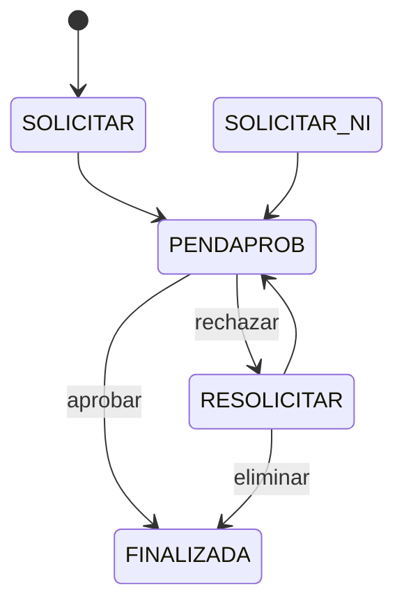
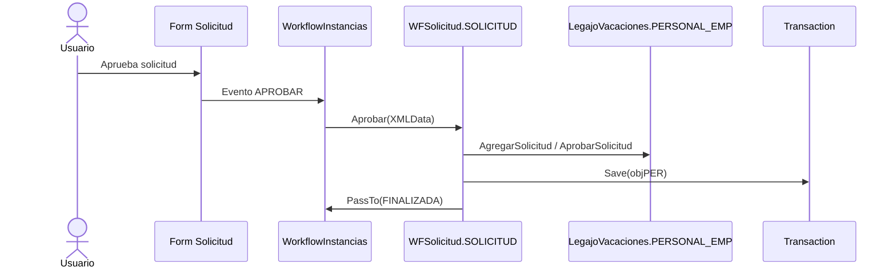
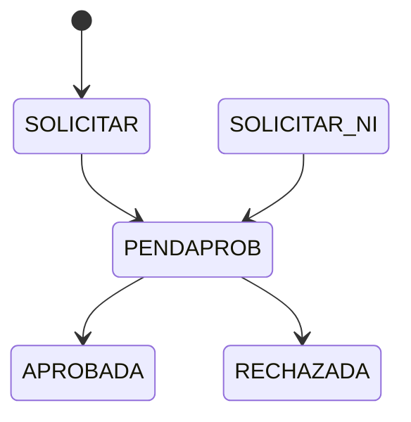
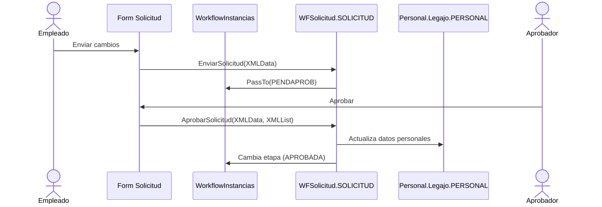
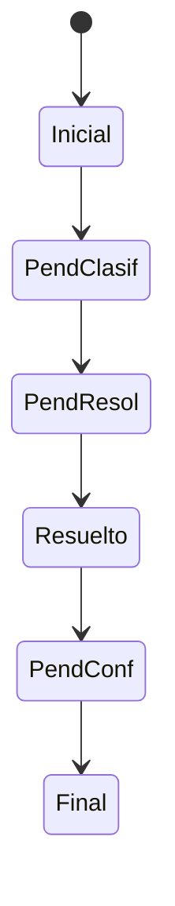
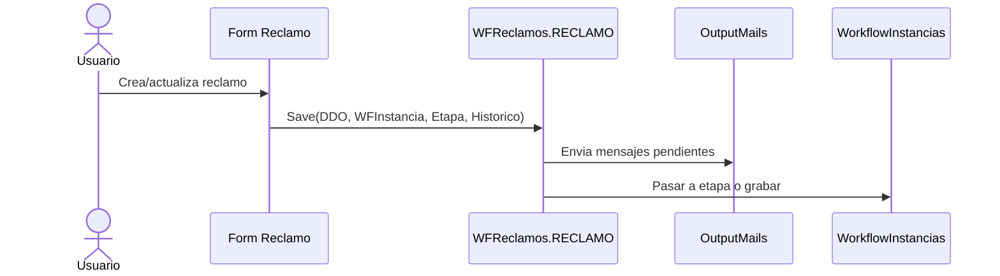

# Flujos y workflows

Este documento resume workflows observados en `Workflow/` y su logica en clases `WFSolicitud` y `WFReclamos`.

## Workflow: Solicitud de Vacaciones
Fuente: `Workflow/NucleusRH/Base/Vacaciones/Solicitud.WF.xml` y `Class/NucleusRH/Base/Vacaciones/lib_v11.WFSolicitud.SOLICITUD.NomadClass.cs`.

### Estados y transiciones

### Secuencia (aprobar solicitud)

## Workflow: Cambio de Datos Personales
Fuente: `Workflow/NucleusRH/Base/Personal/Solicitud.WF.xml` y `Class/NucleusRH/Base/Personal/lib_v11.WFSolicitud.SOLICITUD.cs`.

### Estados y transiciones

### Secuencia (enviar y aprobar)

## Workflow: Reclamos
Fuente: `Workflow/NucleusRH/Base/QuejasyReclamos/Reclamo.WF.xml` y `Class/NucleusRH/Base/QuejasyReclamos/lib_v11.WFReclamos.RECLAMO.cs`.

### Estados y transiciones

### Secuencia (guardar y notificar)

## Observaciones comunes
- Los workflows se definen en XML con etapas, formularios asociados y acciones.
- La logica de negocio se implementa en clases C# que operan sobre DDOs y transacciones Nomad.

## Fuentes
- `Workflow/NucleusRH/Base/Vacaciones/Solicitud.WF.xml`
- `Workflow/NucleusRH/Base/Personal/Solicitud.WF.xml`
- `Workflow/NucleusRH/Base/QuejasyReclamos/Reclamo.WF.xml`
- `Class/NucleusRH/Base/Vacaciones/lib_v11.WFSolicitud.SOLICITUD.NomadClass.cs`
- `Class/NucleusRH/Base/Personal/lib_v11.WFSolicitud.SOLICITUD.cs`
- `Class/NucleusRH/Base/QuejasyReclamos/lib_v11.WFReclamos.RECLAMO.cs`
