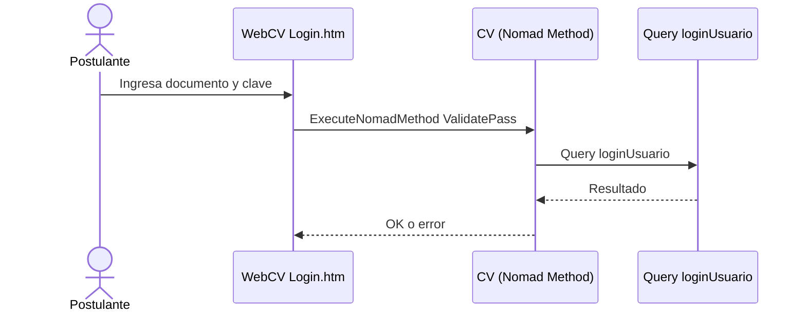
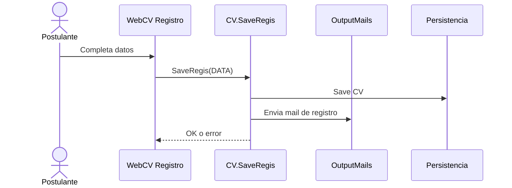
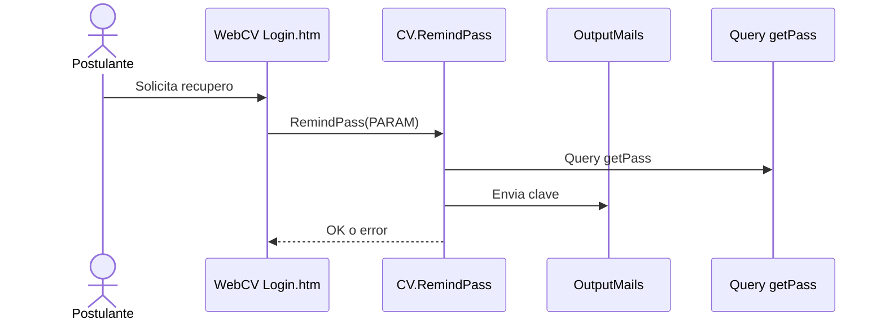
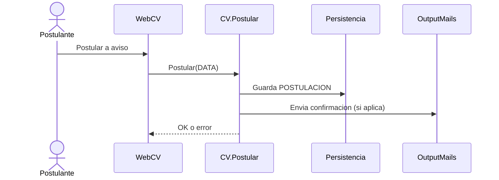

# WebCV (Portal de postulantes)

## Objetivo
WebCV es el portal web para postulantes. Contiene paginas HTML, scripts JS y templates de consultas para cargar y gestionar CVs.

## Artefactos principales
- Paginas HTML en `WebCV/` y `WebCV/Templates/Pages/` (ejemplos: `Login.htm`, `Registro.htm`, `CargaCV_*`).
- Scripts en `WebCV/Scripts/` (ejemplo: `controls.js`).
- Consultas en `WebCV/Templates/Queries/` (listados de tipos, provincias, idiomas, etc.).

## Flujos principales

### Login
Fuente: `WebCV/Templates/Pages/Login.htm` y `Class/NucleusRH/Base/SeleccionDePostulantes/lib_v11.CVs.CV.NomadClass.cs`.

### Registro de CV
Fuente: `Class/NucleusRH/Base/SeleccionDePostulantes/lib_v11.CVs.CV.NomadClass.cs` (metodo `SaveRegis`).

### Recupero de clave
Fuente: `Class/NucleusRH/Base/SeleccionDePostulantes/lib_v11.CVs.CV.NomadClass.cs` (metodo `RemindPass`).

### Postulacion a aviso
Fuente: `WebCV/Templates/Pages/Login.htm` y `Class/NucleusRH/Base/SeleccionDePostulantes/lib_v11.CVs.CV.NomadClass.cs` (metodo `Postular`).

## Observaciones
- El portal consume metodos Nomad desde el navegador (`ExecuteNomadMethod`).
- El dominio de CV maneja datos personales, experiencias, idiomas y postulaciones.

## Fuentes
- `WebCV/Templates/Pages/Login.htm`
- `WebCV/Templates/Pages/Registro.htm`
- `WebCV/Templates/Pages/CargaCV_*.htm`
- `WebCV/Scripts/controls.js`
- `Class/NucleusRH/Base/SeleccionDePostulantes/lib_v11.CVs.CV.NomadClass.cs`
