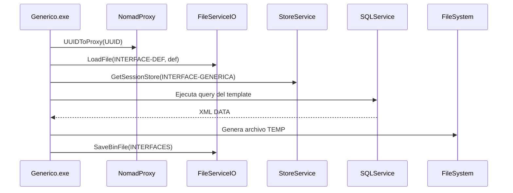

# Interfaces e integraciones

## Interfaces de salida (InterfacesOut)
El proyecto incluye un generador generico de archivos de salida para integraciones con bancos, legales y sindicatos.

### Flujo tecnico del generador generico
Fuente: `InterfacesOut/Source/Generico/Program.cs` y `InterfacesOut/Source/Generico/Classes/clsGenericWriter.cs`.

### Definiciones disponibles
Carpeta `InterfacesOut/Definitions` contiene templates para bancos, legales y sindicatos. Ejemplos:
- Bancos: `BANCOS.GALICIA.GENERICO.XML`, `BANCOS.NACION.GENERICO.XML`, `BANCOS.FRANCES.GENERICO.xml`.
- Legales: `LEGALES.LIBROSUELDODIGITAL.GENERICO.xml`, `LEGALES.SICOSS.GENERICO.XML`, `LEGALES.SIJP.GENERICO.XML`.
- Sindicatos: `SINDICATOS.UOM.GENERICO.XML`, `SINDICATOS.SMATA.GENERICO.xml`.

### Consideraciones de formato
El generador incluye reemplazo de caracteres no ASCII (ver `InterfacesOut/Source/Generico/Classes/clsFunctions.cs`).

## Interfaces de entrada / intercambio
Se identifican definiciones de interfaces en `Interfaces/`:
- `Interfaces/NucleusRH/Base/Liquidacion/*.XML`
- `Interfaces/NucleusRH/Base/Tiempos_Trabajados/Liquidacion/ArchivoHoras.XML`

Ejemplo: `ArchivoHoras.XML` define una query sobre liquidacion y genera salida en texto.

## Servicios de integracion observados
- **SQLService**: ejecucion de consultas y queries (ej. interfaces y login WebCV).
- **FileServiceIO / BINService**: lectura/escritura de archivos y binarios.
- **StoreService**: almacenamiento de parametros de interfaz en sesion.
- **OutputMails**: envio de notificaciones y correos.

## Fuentes
- `InterfacesOut/Source/Generico/Program.cs`
- `InterfacesOut/Source/Generico/Classes/clsGenericWriter.cs`
- `InterfacesOut/Source/Generico/Classes/clsFunctions.cs`
- `InterfacesOut/Definitions/*.xml`
- `Interfaces/NucleusRH/Base/Liquidacion/*.XML`
- `Interfaces/NucleusRH/Base/Tiempos_Trabajados/Liquidacion/ArchivoHoras.XML`
