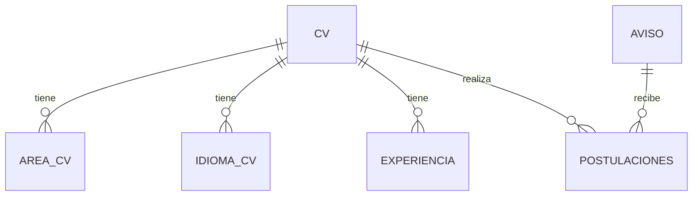
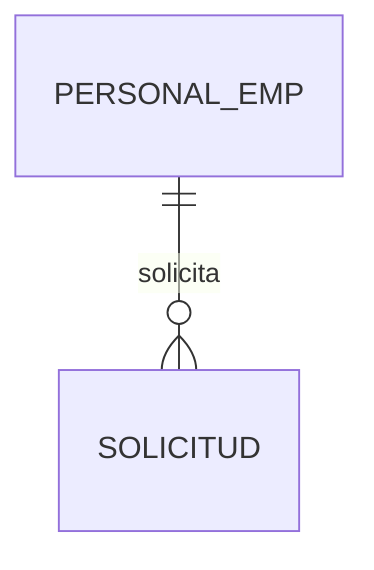
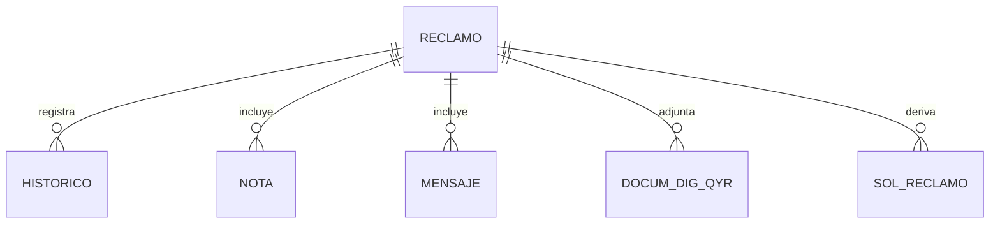

# Modelo de datos (conceptual)

El modelo se construye a partir de clases y colecciones observadas en el codigo. No reemplaza el esquema fisico de la base.

## Dominio: CV y Postulaciones
Fuente: `Class/NucleusRH/Base/SeleccionDePostulantes/lib_v11.CVs.CV.NomadClass.cs`.

Entidades observadas:
- `CV` (postulante) y colecciones `AREAS_CV`, `IDIOMAS_CV`, `EXPERIENCIA`, `POSTU_CV`.
- `AVISO` (avisos de seleccion) usado al postular.

## Dominio: Vacaciones
Fuente: `Class/NucleusRH/Base/Vacaciones/lib_v11.WFSolicitud.SOLICITUD.NomadClass.cs`.

## Dominio: Reclamos
Fuente: `Class/NucleusRH/Base/QuejasyReclamos/lib_v11.WFReclamos.RECLAMO.cs`.

## Notas
- La base de datos y scripts se encuentran en `Database/` (ej. `Database/base11desa.xml`).
- Los modulos de base listados por sufijo incluyen: Nomad, Accidentabilidad, Capacitacion, Control_de_Visitas, Evaluacion, Gestion_de_Postulantes, Liquidacion, MedicinaLaboral, Organizacion, Personal, Postulantes, Sanciones, Tiempos_Trabajados, Vacaciones.

## Fuentes
- `Class/NucleusRH/Base/SeleccionDePostulantes/lib_v11.CVs.CV.NomadClass.cs`
- `Class/NucleusRH/Base/Vacaciones/lib_v11.WFSolicitud.SOLICITUD.NomadClass.cs`
- `Class/NucleusRH/Base/QuejasyReclamos/lib_v11.WFReclamos.RECLAMO.cs`
- `Database/base11desa.xml`
