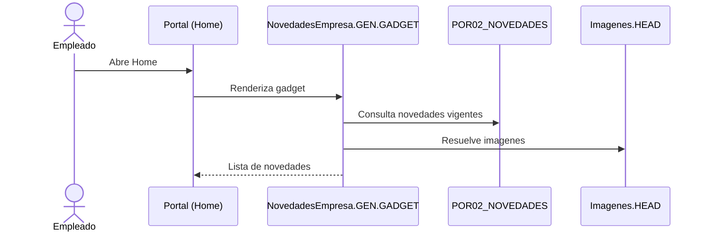
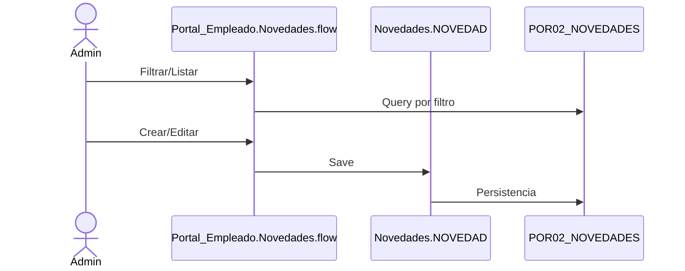

# Portal del Empleado

## Objetivo
El Portal del Empleado es el frente de autogestion. Permite consultar recibos/formularios, acceder a solicitudes de workflow y ver contenido (novedades, eventos, etc.).

## Componentes principales
- **Menu de autogestion**: se define en `Menu/NucleusRH/Base/Base.portal.menu.xml` y se renderiza con `Html/NucleusRH/Base/Portal_Empleado/Menu.rpt.XML` leyendo `Menus\Base.portal.menu.xml` desde filestore.
- **Menu administrativo del portal**: `Menu/NucleusRH/Base/POR.menu.xml` habilita la administracion de novedades y la consola de workflows.
- **Home y secciones**: `Form/NucleusRH/Base/PortalEmpleado/PortalEmpleado.form.xml` contiene secciones y links (datos personales, desarrollo, equipo, etc.).
- **Novedades**: DDOs `Class/NucleusRH/Base/Portal_Empleado/Novedades.NomadClass.XML` y `Class/NucleusRH/Base/Portal_Empleado/Tipos_Novedades.NomadClass.XML` + flow `Form/NucleusRH/Base/Portal_Empleado/Novedades/flow.XML`.
- **Gadgets de novedades**: `Html/NucleusRH/Base/Portal_Empleado/NovedadesEmpresa.GEN.GADGET.XML` y `NovedadesEmpresa_detail.GEN.GADGET.XML`.
- **Imagenes**: `Class/NucleusRH/Base/Portal_Empleado/Imagenes.NomadClass.XML` (POR03_IMAGENES / POR03_BINARIOS).
- **Bandejas Mail**: `Html/NucleusRH/Base/Portal_Empleado/BandejasMail.rpt.XML` muestra correos desde archivos XML en filestore.

## Flujos relevantes

### Acceso a autogestion y workflows
El portal integra workflows para datos personales, familiares y licencias, con acceso desde el icono de workflows y desde el menu.

### Novedades (lectura)

### Novedades (gestion)

## Configuracion del portal (segun repo)
- **Activar modulo**: `Config/NucleusRH/Base/Application.xml` incluye `NucleusRH.Base.Portal_Empleado` con sufijo `POR`.
- **Tabs y formularios de inicio**: `Config/NucleusRH/Base/Resource.cfg.xml` define `start-form-menu-portal` y pestañas con modo `PORTAL`.
- **Menu portal**: `Menu/NucleusRH/Base/Base.portal.menu.xml` y `Html/NucleusRH/Base/Portal_Empleado/Menu.rpt.XML`.
- **Contenido (novedades)**: DDOs en `Class/NucleusRH/Base/Portal_Empleado/` y flow en `Form/NucleusRH/Base/Portal_Empleado/Novedades/`.
- **Acceso a workflows**: requiere que el empleado este en un nodo de organigrama con permiso de inicio (ver `Document/NucleusRH/Base/Portal_Empleado/Acceso_Portal.wiki`).
- **Paginas web/portal**: ver definiciones en `Document/NucleusRH/Base/Portal_Empleado/PagWebPortal.wiki`.

## Fuentes
- `Form/NucleusRH/Base/PortalEmpleado/PortalEmpleado.form.xml`
- `Menu/NucleusRH/Base/Base.portal.menu.xml`
- `Menu/NucleusRH/Base/POR.menu.xml`
- `Html/NucleusRH/Base/Portal_Empleado/Menu.rpt.XML`
- `Html/NucleusRH/Base/Portal_Empleado/NovedadesEmpresa.GEN.GADGET.XML`
- `Html/NucleusRH/Base/Portal_Empleado/NovedadesEmpresa_detail.GEN.GADGET.XML`
- `Class/NucleusRH/Base/Portal_Empleado/Novedades.NomadClass.XML`
- `Class/NucleusRH/Base/Portal_Empleado/Tipos_Novedades.NomadClass.XML`
- `Class/NucleusRH/Base/Portal_Empleado/Imagenes.NomadClass.XML`
- `Form/NucleusRH/Base/Portal_Empleado/Novedades/flow.XML`
- `Document/NucleusRH/Base/Portal_Empleado/Portal_uso_empleado.wiki`
- `Document/NucleusRH/Base/Portal_Empleado/Acceso_Portal.wiki`
- `Document/NucleusRH/Base/Portal_Empleado/PagWebPortal.wiki`
