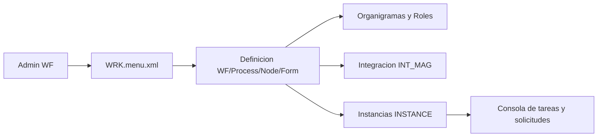

# NucleusWF (motor de workflows)

## Objetivo
NucleusWF provee definicion, ejecucion y administracion de workflows. Se compone de estructuras de WF, procesos, nodos, formularios, variables y organigramas, y un runtime de instancias con logs y estados.

## Componentes de definicion
- **WF**: definicion general, variables y exportacion (`Class/NucleusWF/Base/Definicion/lib_v11.Workflows.WF.NomadClass.cs`).
- **PROCESS / NODE / FORM**: estructura de procesos, nodos y formularios, con validaciones (`Class/NucleusWF/Base/Definicion/lib_v11.Workflows.PROCESS.NomadClass.cs`, `lib_v11.Workflows.NODE.NomadClass.cs`, `lib_v11.Workflows.FORM.NomadClass.cs`).
- **Variables y grupos**: `lib_v11.Workflows.VAR_GROUP.NomadClass.cs`, `lib_v11.Workflows.VAR.NomadClass.cs`.
- **Organigramas**: estructura de roles y responsables (`Class/NucleusWF/Base/Definicion/lib_v11.Organigramas.ORGANIGRAMA.NomadClass.cs`).
- **Integracion**: administrador de interfaces (`Class/NucleusWF/Base/Definicion/lib_v11.Integracion.INT_MAG.NomadClass.cs`).

## Componentes de ejecucion
- **INSTANCE**: runtime de instancias, parametros, logs y errores (`Class/NucleusWF/Base/Ejecucion/lib_v11.Instancias.INSTANCE.NomadClass.cs`).
- **Consolas y reportes**: `Html/NucleusWF/Base/Ejecucion/*.rpt.xml` (carpetas, tareas, instancia, base de inicio y reportes por workflow).

## Menu y administracion
`Menu/NucleusWF/Base/WRK.menu.xml` expone definiciones, organigramas, integraciones, parametros y export/import.

## Flujo general (definicion -> ejecucion)

## Relacion con NucleusRH y Portal
- El portal dispara workflows de autogestion (datos personales, vacaciones, etc.) definidos por NucleusWF y reportes HTML de ejecucion.
- Adicionalmente, existen workflows propios en `Workflow/NucleusRH/Base/*/*.WF.xml` con clases `WFSolicitud`/`WFReclamos`.

## Configuracion relevante
- **Modulos**: `Config/NucleusRH/Base/Application.xml` incluye `NucleusWF.Base.Definicion` y `NucleusWF.Base.Ejecucion`.
- **Dependencias**: `Config/NucleusWF.Base.DEPENDENCES.xml`.
- **Menu**: `Menu/NucleusWF/Base/WRK.menu.xml`.
- **Reportes**: `Html/NucleusWF/Base/Definicion/*.rpt.xml`, `Html/NucleusWF/Base/Ejecucion/*.rpt.xml`.

## Fuentes
- `Class/NucleusWF/Base/Definicion/lib_v11.Workflows.WF.NomadClass.cs`
- `Class/NucleusWF/Base/Definicion/lib_v11.Workflows.PROCESS.NomadClass.cs`
- `Class/NucleusWF/Base/Definicion/lib_v11.Workflows.NODE.NomadClass.cs`
- `Class/NucleusWF/Base/Definicion/lib_v11.Workflows.FORM.NomadClass.cs`
- `Class/NucleusWF/Base/Ejecucion/lib_v11.Instancias.INSTANCE.NomadClass.cs`
- `Menu/NucleusWF/Base/WRK.menu.xml`
- `Html/NucleusWF/Base/Ejecucion/*.rpt.xml`
- `Workflow/NucleusRH/Base/*/*.WF.xml`
